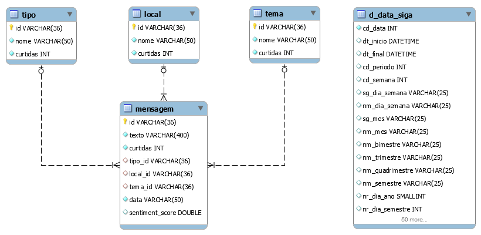

# 🏙 prodamjuntocomcidadao-mysql

`ProdamJuntoComCidadao` - Banco de dados para o projeto [prodamjuntocomcidadao], Hackathon Prodam 2020/11, em MySQL.

## Como carregar

Usando o MySQL Workbench, selecione _File_, _Run Script SQL..._.

Selecione o arquivo desejado:

* Somente estrutura, em [`scripts/prodamjuntocomcidadao-nodata.sql`](scripts/prodamjuntocomcidadao-nodata.sql)
* Estrutura e dados de exemplo, em [`scripts/prodamjuntocomcidadao-withdata.sql`](scripts/prodamjuntocomcidadao-withdata.sql)

Selecione o conjunto de caracteres `utf8` e execute clicando em _Run_.

_Se preferir, você pode usar outro cliente, como o DBeaver, por exemplo._

## Modelo de dados

Arquivo do MySQL Workbench: [`model/prodamjuntocomcidadao.mwb`](model/prodamjuntocomcidadao.mwb)

**Diagrama Entidade-Relacionamento**

